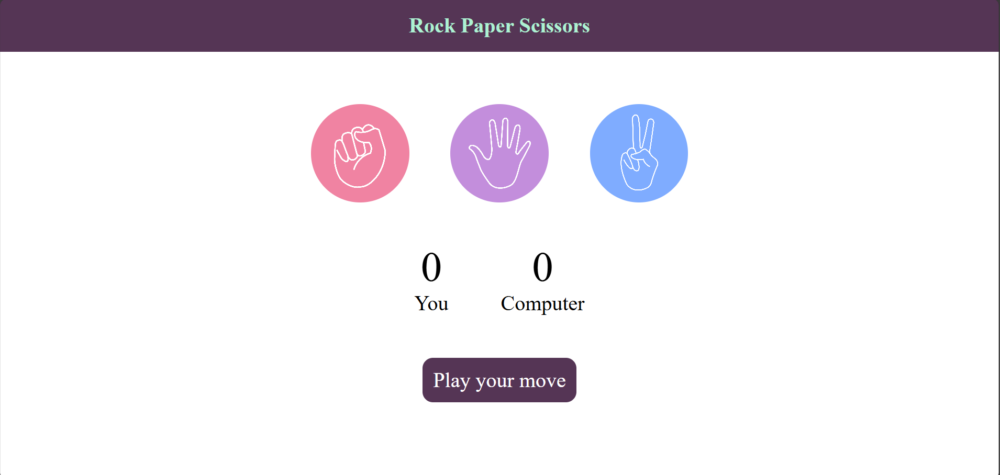

# 🪨 Rock-Paper-Scissors Game

A responsive, browser-based Rock-Paper-Scissors game built with **HTML**, **CSS**, and **JavaScript**. Play against the computer, track your score, and enjoy a clean, intuitive interface.

---

## 🚀 Features

- 🎮 Interactive gameplay with real-time score tracking  
- 📱 Responsive design for desktop and mobile  
- 🧠 Simple AI logic for computer moves  
- 🎨 Styled buttons and transitions for smooth UX  
- 🗂️ Organized file structure with `assets/` folder for images

---

## 📁 Project Structure

```plaintext
ROCK-PAPER-SCISSORS/
├── index.html           # Main HTML file
├── style.css            # Styling for layout and visuals
├── app.js               # Game logic and interactivity
├── assets/              # Folder for images and other media
│   ├── rock.png         # Rock icon
│   ├── paper.png        # Paper icon
│   ├── scissors.png     # Scissors icon
│   └── preview.png      # Screenshot of the game interface
└── README.md            # Project documentation
```

---

## 🛠️ Technologies Used

- **HTML5** – Semantic layout  
- **CSS3** – Flexbox, transitions, responsive design  
- **JavaScript** – DOM manipulation, event handling, game logic

---

## 📸 Demo



---

## 🧠 What I Learned

- Structuring projects with clarity using folders like `assets/`
- Debugging DOM events and script loading issues
- Writing clean, modular JavaScript for game logic
- Enhancing UX with responsive styling and intuitive layout

---

## 📌 How to Use

1. Clone the repo  
   `git clone https://github.com/your-username/rock-paper-scissors.git`

2. Open `index.html` in your browser  
3. Click a move to play against the computer  
4. Watch your score update dynamically!

---

## 🙋‍♀️ Author

**Anushka** – Passionate about web development and always curious about how HTML, CSS, and JS interact.  
Feel free to connect or check out more of my projects!

---

## 📄 License

This project is open-source and available under the [MIT License](LICENSE).


